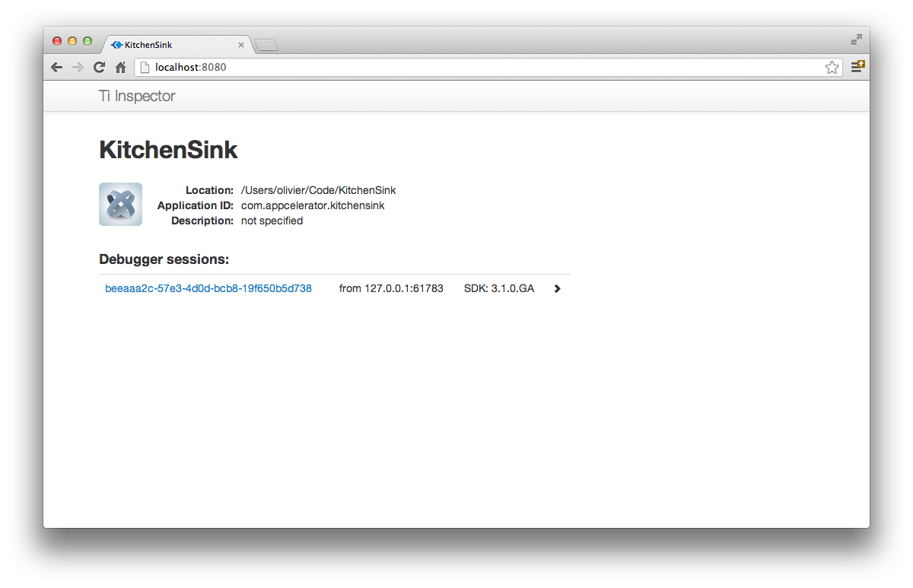
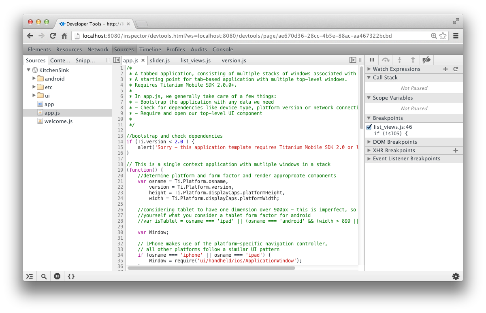

#Ti Inspector

Ti Inspector allows debugging Appcelerator Titanium applications in the Chrome DevTools web interface.

The tool acts as a gateway by translating commands and messages between the [Chrome DevTools Debugging Protocol](https://developers.google.com/chrome-developer-tools/docs/protocol/1.0/) and the [Titanium Debugger Protocol](http://docs.appcelerator.com/titanium/latest/#!/guide/Debugger_Protocol) (and vice-versa).

Currently only the iOS target platform is supported. Android support requires more work and it will be added as soon as possible. 

##Motivation
Since my Titanium development workflow mainly revolves around Sublime Text and the CLI, and firing up Titanium Studio for tracking down bugs in the integrated debugger is most of the time a painfully slow activity (start the IDE, rebuild for debugging, etc.), I wanted a more agile way to fire up a JavaScript debug session. Moreover, when debugging native modules in Xcode, sometimes it would be nice to have a view on both sides (JS and native) of the code.

You can find a more detailed post and a short demo [here](http://titaniumninja.com/debugging-titanium-apps-with-chrome-devtools/)

##Install

For running Ti Inspector a working [node.js](http://nodejs.org/) setup is required.

The Ti Inspector module can be installed through npm with

~~~
    $ [sudo] npm install -g ti-inspector
~~~

##Dev install
In alternative, if you like to stay on the edge, you can pull the code from github and use `npm link`:

~~~
  $ git clone git@github.com:omorandi/TiInspector.git
  $ cd TiInspector
  $ [sudo] npm link
~~~

##Using Ti Inspector

The `ti-inspector` script can be invoked from the command line with the following arguments:

~~~
    ti-inspector [Options] [TiProjectDir]
    
    options:
       --web-host=[host]      host for the inspector server (default localhost)
       --web-port=[port]      port for the inspector server (default 8080)
       --debugger-port=[port] port for the Titanium debug server (default 8999)
        
    TiProjectDir: 
       Directory containing a Titanium app project. 
       If not specified, the current directory is used.
~~~

Supposing you have a terminal open on a directory containing the Titanium project you want to debug you can simply issue:

~~~
    $ ti-inspector
~~~

which runs the script with the default argument values, then point the browser to http://localhost:8080 where a web page for the current project is shown, telling that no active debugging session is present.

In order to start the Titanium application for debugging it, you have to use the Titanium CLI `build` command, using the `--debug-host` hidden option. For example:

~~~
    $ titanium build -p iphone --debug-host localhost:8999
~~~

The `--debug-host` argument represents the `host:port` pair where the debug server is listening. This is normally provided by Titanium Studio when the project is started in debug mode, however in our case Ti Inspector will act as a debug server (listening by default on tcp port 8999) for the running app. 

Once the app is running in the iOS Simulator, only the splash screen will be visible, while in the page previously opened in the browser will list the current debug session:

By clicking on it, the DevTools page will be open, showing the `app.js` file source code, stopped on the first executable line:

From there on, you can debug your application by setting breakpoints, stepping through code, watching variables, or evaluating expressions in the console panel, etc.

## Features

* Breakpoints: setting/removing breakpoints, conditional breakpoints
* Call stack inspection (when execution is suspended)
* Variables and objects inspection
* Watch expressions
* Step operations (step over, step-into, step-out)
* Console logging
* Expression evaluation in the console (only when execution is suspended)
* Suspend on exceptions (disabled by default)
* Direct source editing and CMD-S for saving changes in your original JS files

## Limitations

* Android is not currently supported: supporting Android will mean implementing the [V8 remote debugging protocol](https://code.google.com/p/v8/wiki/DebuggerProtocol) in Ti Inspector. This is something I'll likely work on in the near future
* On device debugging is not supported since it's treated in a special way by the CLI and Studio, though there exist some hackish ways for achieving the same result in a semi-manual way
* Expressions can only be evaluated when the execution is suspended
* TiAlloy (and any other, e.g. CoffeeScript) source mapping is not supported

## License

MIT

